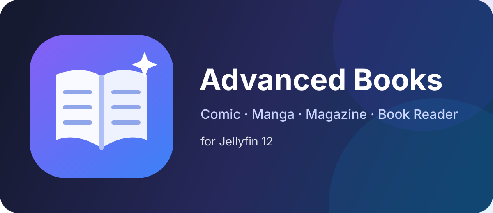

# Jellyfin Advanced Books

<p align="center">
  
</p>

Advanced book, comic, manga and magazine support for **Jellyfin 12**.

> **Status: early development / not yet a stable release.**
> Komga-compatible One-Shot handling, safe CBZ/ZIP per-page delivery, paged/continuous Advanced Reader modes, Jellyfin-backed reading progress, book metadata, smart spreads, lazy thumbnail navigation, per-user reader preferences, and all-mode pinch zoom are implemented.

## What this project is for

Jellyfin 12 significantly improves Books, but dedicated comic servers still provide stronger library semantics and reading controls. Jellyfin Advanced Books aims to close that gap without forcing users to reorganize an existing Komga library. Komga and Jellyfin can point at the same read-only media tree.

## Current features

- Jellyfin Server **12.0.x** / .NET 10 foundation.
- Komga-style `_oneshots` and `/_oneshots` matching.
- Configurable One-Shot series mapping.
- Authenticated CBZ/ZIP page metadata API.
- Per-page image streaming instead of whole-CBZ browser download/extraction.
- Natural page ordering (`page2` before `page10`).
- Archive entry/page/size/compression-ratio limits and traversal rejection.
- **Single Page** and **Double Page** reader modes, with Komga-style smart spreads that keep the first/last and detected landscape pages single.
- **Vertical Continuous** and **Webtoon** reader modes.
- RTL/LTR page navigation for paged modes.
- Fit Screen / Width / Height / Original sizing with measured reader-viewport dimensions.
- 50%-400% reader zoom; paged drag-to-pan plus continuous desktop pan.
- **Two-finger pinch-to-zoom in paged, Vertical Continuous and Webtoon modes.**
- **Responsive auto-hiding reader chrome** with center-tap/click reveal.
- **Direct page scrubber in every reader mode** for fast long-book navigation.
- **Live thumbnail preview while scrubbing** with pointer-anchored placement and faster authenticated loading.
- Intent-aware desktop chrome reveal so minor mouse jitter does not reopen hidden controls.
- Compact desktop controls and a mobile settings bottom sheet.
- The reader header shows Jellyfin title, authors, series/issue and year metadata when available, with per-field visibility controls and optional automatic scrolling when text overflows.
- Persisted black/gray/white reader backgrounds, optional page-transition animation, optional touch gestures, and contextual keyboard/gesture help.
- Continuous/Webtoon side padding and page-gap controls.
- Reader fullscreen toggle on supported browsers/wrappers.
- Keyboard, click/tap, swipe and wheel controls.
- IntersectionObserver-based continuous lazy loading plus directional read-ahead.
- Strict one-image-per-page Continuous/Webtoon slots with generation guards, preventing concurrent lazy-load/prefetch requests from duplicating a page in the DOM.
- Stabilized mixed-size continuous-page geometry with learned aspect ratios, viewport-marker current-page tracking and explicit scroll anchoring.
- Bounded page cache, nearby prefetch and distant-request cancellation.
- **Self-healing thumbnail page navigator** with visible-first scheduling, periodic viewport watchdog, timeout recovery, bounded full-page fallback and direct page jumping.
- Server-side thumbnail generation through Jellyfin's image processor.
- Bounded thumbnail cache in the browser and plugin data directory.
- **Per-user reading position stored in Jellyfin user data.**
- **Automatic resume from the saved page across Jellyfin Web clients, including books already marked played.**
- **Per-user reader preferences stored in Jellyfin's display-preferences database.**
- **Six-language UI localization:** English, Japanese, German, French, Spanish and Simplified Chinese, following the Jellyfin/browser language automatically.
- Reader layout, direction, fit mode, zoom, continuous side padding/page gap, background, transition animation, touch gestures, metadata visibility and metadata auto-scroll choices restore across Jellyfin Web clients for the same user.
- Final-page completion marks the Jellyfin Book as played.
- Resume positions use Jellyfin's built-in ComicsPlayer page/tick convention.
- Optional automatic Jellyfin Web integration through a Jellyfin 12-compatible JavaScript Injector plugin.
- Reproducible root-level plugin ZIP packaging with MD5 and SHA-256 checksums.
- Jellyfin repository `manifest.json` generation for published releases.
- No source-file moves, renames or rewrites.

Example Komga-compatible layout:

```text
Books/
├── Space Adventures/
│   ├── Space Adventures v01.cbz
│   ├── Space Adventures v02.cbz
│   └── _oneshots/
│       └── Pluto Adventures.cbz
└── _oneshots/
    ├── A oneshot.cbz
    └── Another oneshot.cbz
```

## Advanced Reader (development preview)

The reader consumes individual pages through Advanced Books rather than downloading the complete CBZ into the browser.

Available modes are Single Page, Double Page, Vertical Continuous and Webtoon. Double Page determines the current/next page orientation before committing the spread to the DOM, so the first/last and detected landscape pages remain single without briefly rendering a guessed two-page spread first. Continuous modes place lightweight placeholders for the document but fetch image bytes only near the reader viewport. Every page slot owns exactly one placeholder or one page image; concurrent observer/prefetch loads can replace that slot but cannot append duplicate images. Distant pages are evicted from the Blob cache and can be loaded again when revisited.

The top chrome displays the current Jellyfin book title plus optional author/series/issue/year context instead of a generic reader label. Metadata can be hidden globally or field-by-field, and overflowing metadata can automatically pan horizontally so the full value becomes readable. Reader controls no longer consume permanent screen space. A compact top chrome and bottom navigation strip appear when the reader opens, then auto-hide while reading. On desktop, hidden chrome ignores minor pointer jitter and returns only after deliberate movement (with a lower threshold near the top/bottom edges); on touch devices a center tap/click toggles it. Hovering over visible chrome pauses auto-hide. The bottom strip includes Previous/Next controls plus a page scrubber that can jump directly across long manga volumes in every layout. While scrubbing, a small page thumbnail and page/range label follow the selected position. Loading state is rendered as a centered overlay inside the thumbnail frame, never beside or outside it. Reader settings live in a desktop popover or mobile bottom sheet.

All four layouts support 50%-400% reader zoom. Fit calculations use the actual Reader viewport rather than relying only on CSS dynamic-viewport units, improving Fit Height/Screen behavior in mobile WebViews. Vertical Continuous and Webtoon keep native one-finger vertical scrolling while also supporting the zoom controls, Ctrl+wheel, and two-finger pinch. The pinch bridge now takes exclusive control once the second touch arrives so the page itself does not drift while zooming. At greater than 100% zoom, continuous layouts can be panned with normal scrolling/touch and desktop drag panning. Continuous layouts also expose persisted side-padding and page-gap controls similar to dedicated comic readers.

The **Pages** button opens a thumbnail navigator. Visible cards are evaluated directly from the grid scroll position and rechecked by a periodic watchdog, so a missed observer/scroll callback cannot leave a visible row permanently stuck on `Page N`. Lightweight 128px thumbnails are requested first; if a visible thumbnail request fails or stalls, the navigator can fall back to the authenticated full-page endpoint for that card only. Full-page fallback is limited to two concurrent requests and six retained fallback Blob URLs. Selecting a thumbnail jumps directly to that page.

Reading position is saved to Jellyfin's normal per-user item data after navigation settles and is flushed when the reader closes. Close-time saves keep the newest reached page queued even when an earlier PUT is still in flight. Books reopen at the saved page even when Jellyfin already marks the item played. Reaching the final page marks the Book as played. Non-final progress updates do not clear an existing played state, so starting a reread does not silently mark a completed book unread.

Reader preferences are also stored per Jellyfin user. Single/Double/Vertical/Webtoon layout, RTL/LTR direction, fit mode, zoom, side padding/page gap, background, page-transition animation, touch-gesture state, metadata header/field visibility and metadata auto-scroll are restored after reading-position resume completes so the saved page is established before the saved presentation mode is re-applied. Fit Screen is the safe default; legacy pre-v0.11 preference records that accidentally present Fit Height as the default are migrated to Fit Screen, while a Fit Height choice saved afterward remains explicit and persistent.

### Required companion plugin for Jellyfin Web

To expose the **Advanced Reader** button inside Jellyfin Web, install the community [Jellyfin JavaScript Injector](https://github.com/n00bcodr/Jellyfin-JavaScript-Injector) plugin. Advanced Books detects it at runtime and registers its embedded reader scripts automatically; you do **not** need to copy/paste the Advanced Books reader JavaScript manually.

Starting with **Advanced Books 0.14.0.0**, the integration is registered as six independent JS Injector entries (**Localization, Core, Progress, Preferences, Navigator, Gestures**) instead of one very large combined script. Core remains the required reader script; the localization and feature bridges fail soft so one damaged optional resource cannot disable the complete reader. On startup, Advanced Books also removes the legacy `jellyfin-advanced-books-reader` combined entry.

For **Jellyfin 12**, add this JavaScript Injector repository URL in **Dashboard -> Plugins -> Repositories**:

```text
https://raw.githubusercontent.com/n00bcodr/jellyfin-plugins/main/12/manifest.json
```

Then install **JavaScript Injector** from the Jellyfin plugin catalog and restart Jellyfin. Jellyfin 12 support was introduced in JavaScript Injector `v4.0.0.0`; use the current Jellyfin 12-compatible release.

Without JavaScript Injector, the Advanced Books server-side resolver and APIs can still load, but the **Advanced Reader** button is not automatically inserted into Jellyfin Web.

If the button disappears after upgrading from 0.10.0.0 or older, update Advanced Books, restart Jellyfin, then hard-refresh Jellyfin Web. In JS Injector you should see the six Advanced Books Reader entries above and no legacy single **Advanced Books Reader** combined entry.

See [Advanced Reader](docs/READER.md) for controls and implementation details.

## Reader API

```text
GET /AdvancedBooks/Books/{itemId}/Pages
GET /AdvancedBooks/Books/{itemId}/Pages/{pageIndex}
GET /AdvancedBooks/Books/{itemId}/Pages/{pageIndex}/Thumbnail?width=128
GET /AdvancedBooks/Books/{itemId}/Progress
PUT /AdvancedBooks/Books/{itemId}/Progress
GET /AdvancedBooks/Reader/Preferences
PUT /AdvancedBooks/Reader/Preferences
```

Clients supply only a Jellyfin item ID; raw server filesystem paths are never accepted. Endpoints require an authenticated Jellyfin user and a Book visible to that user where applicable. Unsupported formats return HTTP 415; invalid or safety-rejected archives return HTTP 422.

Thumbnail widths are constrained to 96-320 pixels. Generated thumbnails are cached beneath the plugin data directory using an archive/page/version-aware key. Archive page metadata is reused in memory while the source file remains unchanged, and a larger already-cached thumbnail can satisfy a smaller preview request. Full-resolution extracted work files are not retained.

Progress page indexes are validated against the server-side archive page count. Positions use `pageIndex * 10,000` playback ticks, matching Jellyfin Web's built-in ComicsPlayer convention so the standard and Advanced readers can share resume data.

Reader preferences are stored in Jellyfin's display-preferences database under an Advanced Books-specific namespace. The preferences API always resolves the authenticated Jellyfin user and does not accept an arbitrary user ID.

The page API currently recognizes JPEG, PNG, WebP, GIF, BMP and AVIF image entries. ZIP metadata entries under `__MACOSX` and AppleDouble files beginning with `._` are excluded even when their names use an image extension. Full-page responses are sent `no-store`, carry the served page index for client verification, and the Web reader adds an archive-version query key to avoid stale page reuse after an archive changes. CBR/PDF/EPUB Advanced Reader pipelines are deferred until the ZIP pipeline is proven stable.

## Still planned

Important next milestones are further mobile/touch tuning, live Jellyfin integration testing, and additional book formats. See [the roadmap](docs/ROADMAP.md).

## Requirements

- Jellyfin Server 12.0.x
- A Jellyfin **Books** library
- CBZ/ZIP for the current Advanced Reader preview
- [Jellyfin JavaScript Injector](https://github.com/n00bcodr/Jellyfin-JavaScript-Injector) for automatic Jellyfin Web reader-button integration

The One-Shot resolver follows Jellyfin 12's built-in book extensions: AZW, AZW3, CB7, CBR, CBT, CBZ, EPUB, MOBI and PDF. The Advanced Reader page API currently targets CBZ/ZIP archives only.

## Installation

The recommended installation method is the Jellyfin plugin repository. Add this URL in **Dashboard -> Plugins -> Repositories**:

```text
https://raw.githubusercontent.com/yuuta0331/jellyfin-advanced-books/main/manifest.json
```

Use **Advanced Books** as the repository name, save it, then open **Dashboard -> Plugins -> Catalog -> Books -> Advanced Books** and install the latest Jellyfin 12-compatible release. Restart Jellyfin after installation.

Repository installation is also the recommended upgrade path. New releases are added to the same `manifest.json` with the checksum of the actually published GitHub Release ZIP, so future versions appear in Jellyfin's Catalog without manually replacing DLLs. Install the offered update from Jellyfin and restart the server.

For the Web **Advanced Reader** button, also add the Jellyfin 12 JavaScript Injector repository:

```text
https://raw.githubusercontent.com/n00bcodr/jellyfin-plugins/main/12/manifest.json
```

Install **JavaScript Injector** from its Catalog entry and restart Jellyfin. Advanced Books then registers Localization, Core, Progress, Preferences, Navigator and Gestures automatically; there is no JavaScript copy/paste step.

Development preview and manual ZIP installation remain available as a fallback. When installing manually, stop Jellyfin first, keep only one active Advanced Books version directory, extract the two runtime DLLs into a fresh version directory, and restart Jellyfin. Do not overwrite DLLs inside an older version-named directory while Jellyfin is running.

See the complete [Installation and Updates guide](docs/INSTALLATION.md) for repository setup, update behavior, manual fallback, supported UI languages and Catalog metadata.

## Configuration

1. Install [Jellyfin JavaScript Injector](https://github.com/n00bcodr/Jellyfin-JavaScript-Injector) if you want the **Advanced Reader** button in Jellyfin Web, then restart Jellyfin.
2. Open **Dashboard -> Plugins -> Advanced Books**.
3. Leave **Enable Advanced Reader integration** enabled if JavaScript Injector is installed.
4. Enable **Komga-compatible One-Shots**.
5. Keep `_oneshots` as the matcher for the usual Komga layout, or use `/_oneshots` for segment-prefix matching.
6. Restart Jellyfin and rescan the affected Books library.

By default, a One-Shot uses its book title as its Jellyfin series name, approximating Komga's one-book-series model.

## Safety

The plugin is read-only with respect to media files. Reader APIs resolve a Jellyfin item ID server-side, verify the current user's visibility, and never accept a client-provided media path.

ZIP access enforces bounded entry/page counts, per-page and total uncompressed-byte limits, a maximum compression ratio and unsafe-entry-path rejection. Pages are streamed from archives rather than extracting the whole book to disk or memory.

Thumbnail generation may temporarily extract one validated page to the plugin work directory so Jellyfin can resize it. That source work file is deleted immediately after processing; only the small generated thumbnail cache remains.

Progress writes affect only Jellyfin's normal per-user Book state (`PlaybackPositionTicks`, `Played`, and `LastPlayedDate`); reader preferences affect only Jellyfin's display-preferences database. Source comic files and their metadata are not modified.

## Documentation

- [Installation and Updates](docs/INSTALLATION.md)
- [Advanced Reader](docs/READER.md)
- [Pinch Zoom](docs/PINCH_ZOOM.md)
- [Architecture](docs/ARCHITECTURE.md)
- [Development Guide](docs/DEVELOPMENT.md)
- [Roadmap](docs/ROADMAP.md)
- [Contributing](CONTRIBUTING.md)

## License

MIT. See [LICENSE](LICENSE).

This is a community project and is not affiliated with the Jellyfin, Komga, or JavaScript Injector projects.
